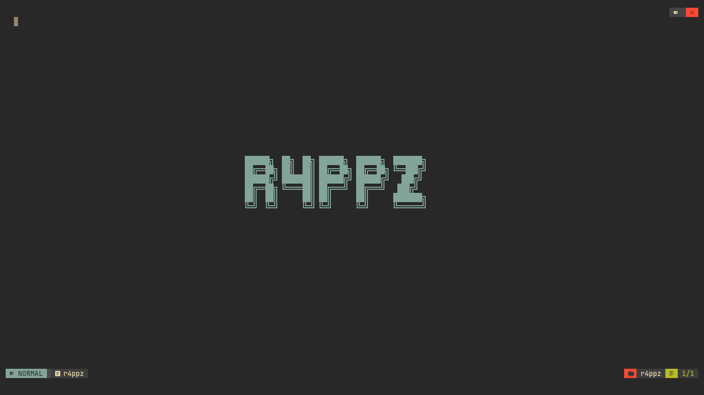

# startup.nvim

I liked it and forked it to change the logo to my user name lol

## Screenshot



## Installation

**Lazy.nvim**

```lua
{
    "r4ppz19/startup.nvim",
    lazy = false,
    opts = { color = "#98c379" } -- Your preferred color
}
```
