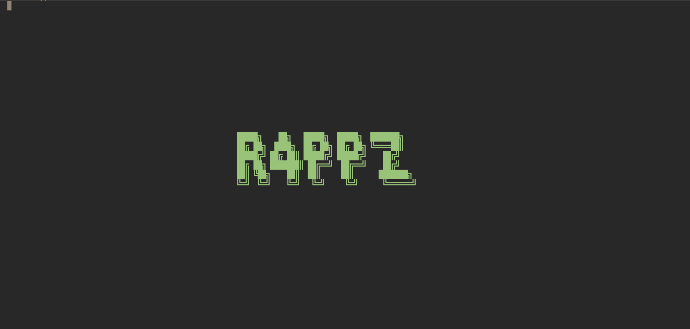

# r4ppz.nvim (Forked)

This repository is a fork of [minintro.nvim](https://github.com/eoh-bse/minintro.nvim).

I liked it and forked it to change the logo to my user name lol

## Screenshot



## Installation

**Lazy.nvim**

```lua
{
    "r4ppz/r4ppz.nvim",
    lazy = false, -- Or true if you prefer, ensure it loads on VimEnter or similar
    opts = { color = "#98c379" } -- Your preferred color
}
```

**Packer.nvim**

```lua
use {
    "r4ppz/r4ppz.nvim",
    config = function() 
        require("r4ppz").setup({ color = "#98c379" }) -- Your preferred color
    end
}
```

## Configuration

The only option is `color` for the logo:

```lua
require("r4ppz").setup({
    color = "#YOUR_HEX_COLOR" 
})
```

## Credits

This plugin is a fork of [minintro.nvim](https://github.com/eoh-bse/minintro.nvim) by [eoh-bse](https://github.com/eoh-bse).